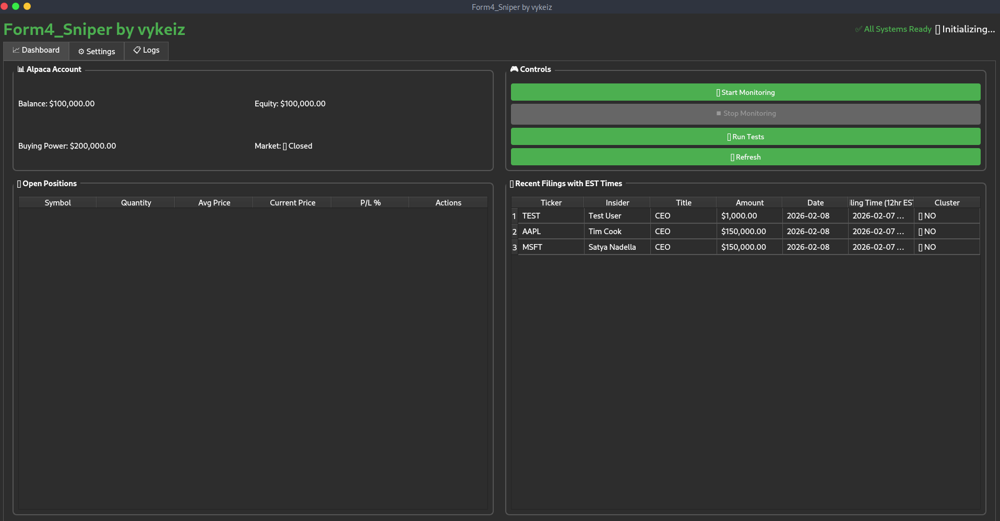
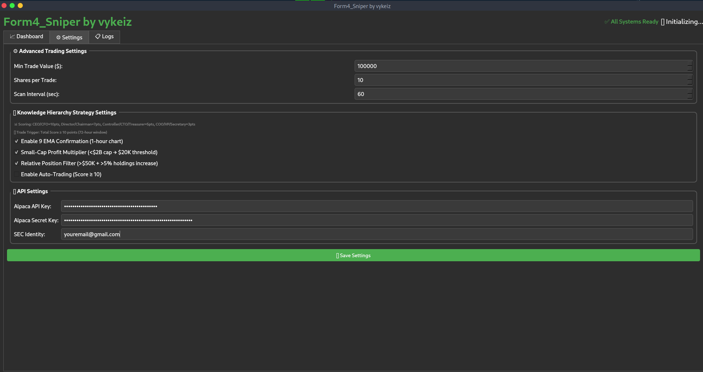

  <h1>Form4_Sniper</h1>

Form4_Sniper is a proprietary, high-frequency monitoring and execution platform designed to capitalize on SEC Form 4 filings. By analyzing "open market purchases" (Code P) by top-tier executives in real-time, the system identifies high-conviction signals where insiders are putting significant personal capital at risk.

The program combines raw SEC data with a sophisticated Knowledge Hierarchy and Cluster Detection system to filter out noise and target trades with the highest statistical probability of success.

🖥️ System Interface
The platform features a professional-grade PyQt6 dashboard designed for real-time monitoring and rapid decision-making.

  

Key UI Modules:
Live SEC Feed: A real-time stream of incoming Form 4 filings, pre-filtered for "Open Market Purchases."

Active Positions: Direct integration with Alpaca for real-time tracking of entries, exits, and current P/L.

Strategy Logs: Detailed breakdown of why a specific filing triggered a "Buy" signal based on the scoring hierarchy.

🧠 The "Knowledge Hierarchy" Strategy
Unlike basic scanners, Form4_Sniper uses a weighted scoring system based on the insider's role and the context of the purchase.

1. Scoring Engine
CEO / CFO (10 Points): Triggers an instant high-conviction alert. These roles have the most intimate knowledge of the company's financial health.

Director / Chairman (7 Points): High-level strategic oversight; significant when combined with other buyers.

VP / General Counsel / Treasurer (5 Points): Institutional knowledge of specific departments or legal/cash flow standing.

2. Cluster Detection
The system monitors for "Cluster Buys"—multiple insiders buying the same ticker within a 72-hour window.

Single Buyer: Evaluated based on title.

2+ Buyers: Points are aggregated. For example, a CEO (10) + a Director (7) creates a 17-point "Super Signal."

3. Technical Confirmation
To ensure optimal entry, the bot integrates technical overlays:

9 EMA / 21 MA Crossovers: Ensures the purchase is aligned with immediate price momentum.

Small-Cap Multiplier: Lower value thresholds are applied for companies under $2B market cap, where insider buying has a more drastic impact on liquidity and price.

🛡️ Risk Management & Execution
The platform is built for disciplined trading, removing the emotional bias of manual execution.

  

Trade Cooldown: Automatically prevents over-exposure by enforcing a 24-hour lockout on any ticker recently traded.

Minimum Value Filters: Only tracks significant "skin in the game" (defaulting to purchases over $50,000).

Auto-Trading Mode: When enabled, the bot executes trades instantly via Alpaca API when a signal exceeds the user-defined point threshold.

📊 Analytics & Reporting
The system maintains a local SQLite database (trades.db) to track performance and refine the hierarchy.

Success Rate by Title: Analyzes whether CEO buys or Cluster buys are yielding higher returns.

Performance Rating: The strategy module provides automated recommendations (e.g., "Excellent performance - consider increasing position sizes for 20+ point scores").

Note: This is a proprietary trading tool. Unauthorized distribution or reverse engineering of the Knowledge Hierarchy Strategy is prohibited.
